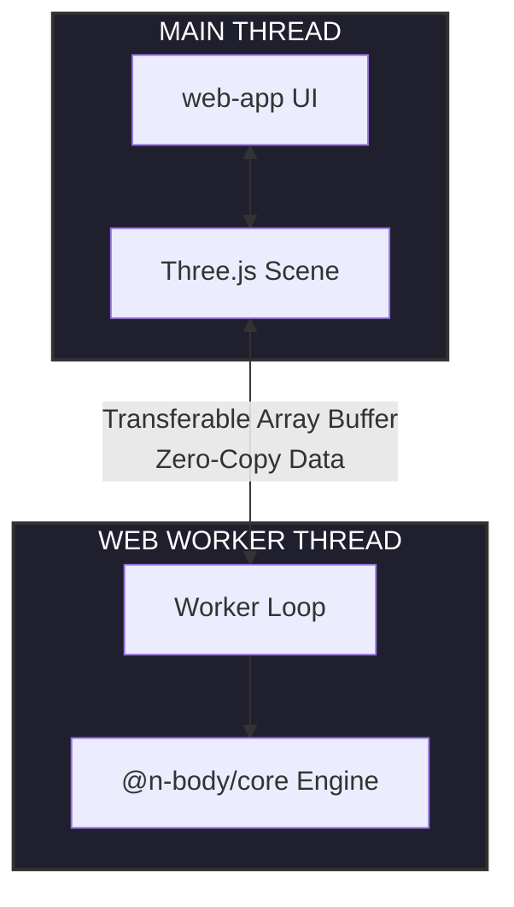

# High-Performance N-Body Simulator (Barnes-Hut Algorithm)

**[English](#english)** · **[Español](#español)**

---

<a id="english"></a>

**English Version**

3D interactive $N$-body web simulator optimized, designed as a fun computational astrophysics project, which implements advance concepts and browser performance improvements.

### 🌌 The Problem It Solves
Simulating gravitational interactions for $N$ particles using traditional brute-force physics requires an $O(N^2)$ computational complexity. As $N$ grows into tens of thousands of stars, the system introduces a massive computational bottleneck that freezes any modern browser. 

This project solves the performance ceiling by implementing the **Barnes-Hut Algorithm**. By partitioning 3D space into an **Octree**, distant clusters of particles are mathematically treated as a single body using their aggregate Center of Mass. This reduces the computational complexity to $O(N \log N)$, enabling fluid, real-time galactic simulations in JavaScript/TypeScript.

### 🏗️ Architecture & Data Flow (C4 Context)

The system leverages a decoupled, multi-threaded frontend architecture tailored for high-frequency numerical calculations without dropping frames.



The project is structured as a monorepo to keep track of the responsabilities clearly. 

1. **`packages/core`**: The pure physics engine. It contains the implementation of the `OctreeNode`, space partitioning bounds, and orbital integrators. It is 100% environment-agnostic.
2. **`packages/worker`**: The execution environment in backstage. It processes the heavy computational load (building the tree and calculating spatial forces) on a separate CPU thread via the Web Workers API.
3. **`packages/web-app`**: The presentation layer. Renders the computed vector fields at 60 FPS using WebGL shaders.

### 🛠️ Tech Stack
* **Language:** TypeScript (Strict Mode)
* **Graphics Rendering:** Three.js / WebGL
* **Parallelization:** Web Workers API (Transferable Objects / Shared Arrays)
* **Project Management:** NPM Workspaces

### ⚙️ Technical Decisions
* **Immutable 3D Vectors:** Vectors used for mathematical transformations are built using immutable patterns to prevent accidental side effects and state mutations inside concurrent environments.
* **Inline Center of Mass Evaluation:** Rather than traversing the entire Octree to re-evaluate structural weight distribution, the aggregate Center of Mass is evaluated dynamically in $O(1)$ time using localized linear momentum tracking during particle insertion.
* **Immutable 3D Vectors:** Vectors used for mathematical transformations are built using immutable patterns to prevent accidental side effects and state mutations inside concurrent environments.
* **Inline Center of Mass Evaluation:** Rather than traversing the entire Octree to re-evaluate structural weight distribution, the aggregate Center of Mass is evaluated dynamically in $O(1)$ time using localized linear momentum tracking during particle insertion.
* **Barnes-Hut Force Softening:** To eliminate mathematical singularities (division by zero) when two particles closely interact, a softening factor ($\epsilon$) is integrated into Newton's Law of Gravitation, keeping galactic cores dynamically stable.
* **Symplectic Integrator (Euler-Cromer):** Implemented a symplectic numerical integration step instead of standard Euler integration. By updating velocities prior to mapping new spatial positions, the engine natively conserves orbital energy over long timelines.

### ⚙️ Deep-Dive Technical Decisions & Physics Foundations

#### 1. The Barnes-Hut Space Partitioning ($O(N \log N)$ vs $O(N^2)$)
* **The Problem:** In a direct N-Body simulation (brute-force), every particle interacts with every other particle. For $N$ particles, the number of interactions is $N(N-1)/2$, leading to an $O(N^2)$ computational complexity. At $10,000$ particles, the CPU must compute $50,000,000$ force vectors *per frame*, stalling the JavaScript engine.
* **The Solution:** The Barnes-Hut algorithm structures the 3D space recursively into an Octree. When calculating the gravitational force on a specific particle, we measure the ratio $\theta = s/d$, where $s$ is the size of the Octree node (cube width) and $d$ is the distance from the particle to the node's Center of Mass. If $\theta$ is less than a predefined threshold (standard $\theta = 0.5$), the entire cluster inside that cube is approximated as a single pseudo-particle positioned at its aggregate Center of Mass. This drops the execution time down to $O(N \log N)$, scaling beautifully to tens of thousands of bodies.

#### 2. Symplectic Integrators vs. Standard Euler: Energy Conservation
* **The Pitfall of Explicit Euler:** Standard numerical integration (Explicit Euler) updates positions using current velocities, and then updates velocities using current forces ($x_{t+1} = x_t + v_t \cdot dt$). In astrophysics, this method introduces a continuous truncation error that artificially injects energy into the system. As a result, closed elliptical orbits turn into outward spirals, causing galaxies to spontaneously dissolve due to numerical errors.
* **The Symplectic Triumph (Euler-Cromer / Leapfrog):** This engine implements a **Symplectic Integrator**. Instead of updating positions with old velocity data, it evaluates the velocity at the next step *first*, and immediately feeds that *new* velocity into the position update ($v_{t+1} = v_t + a_t \cdot dt \rightarrow x_{t+1} = x_t + v_{t+1} \cdot dt$). Mathematically, symplectic integrators preserve **symplectic form** and phase-space volume (Liouville's Theorem). While it still carries local position errors, the total energy of the system oscillates tightly around a constant value rather than drifting infinitely. Orbits stay closed, stable, and physically coherent over long timelines.

#### 3. Gravitational Softening ($\epsilon$)
* **The Math:** Newton's law states $F \propto 1/r^2$. In a discrete digital timeline, if two fast-moving particles happen to cross paths at an extremely close coordinate, the distance $r$ approaches $0$. The force magnitude scales spikes toward infinity, introducing extreme acceleration vectors that launch particles out of the simulation at near-light speeds.
* **The Solution:** We introduce a force-softening parameter ($\epsilon = 0.15$) into the denominator: $F \propto 1/(r^2 + \epsilon^2)$. This effectively models particles not as zero-dimensional points, but as soft, interpenetrable galactic clouds, removing mathematical singularities and keeping star clusters stable during close-range encounters.

---

### 📚 References, Papers & Deep-Dive Literature

If you want to understand the underlying mathematics and computer science principles under the hood, explore these foundational resources:

#### 📜 Academic Papers & Books
* **The Original Barnes-Hut Paper (1986):** Barnes, J., & Hut, P. *A hierarchical $O(N \log N)$ force-calculation algorithm.* Nature, 324(6096), 446-449. [Read via Nature](https://www.nature.com/articles/324446a0).
* **Symplectic Integration Mechanics:** Hairer, E., Lubich, C., & Wanner, G. *Geometric Numerical Integration: Structure-Preserving Algorithms for Ordinary Differential Equations.* Springer. (A masterpiece on why symplectic math conserves phase space volume).
* **Real-Time Physics Simulations:** Erleben, K., Sporring, J., Henriksen, K., & Dohlmann, H. *Physics Based Animation.* Charles River Media.

#### 🌐 High-Quality Blogs & Interactive Explanations
* **The Octree Partitioning Mechanics:** [LearnCpp / GameDev Literature on Spatial Trees](https://www.geeksforgeeks.org/octree-insertion-and-searching/) - Visual breakdown of 3D spatial trees.
* **Why Euler Integration Fails Orbitally:** [Gaffer on Games - Integration Basics](https://gafferongames.com/post/integration_basics/) - The definitive software engineering guide to numerical integration for physics engines.
* **The Barnes-Hut Galaxy Simulation Guide:** [Princeton University Computer Science](https://joshhug.gitbooks.io/hug61b/content/chap2/chap21.html) - Case study on modeling the N-Body problem efficiently.

### 🚀 How to Run It
1. Clone the repository.
2. Install dependencies from the root directory:
    ```bash
    npm install
3. Build the core physics module:
    ```bash
    npm run build --workspace=@n-body/core

🖼️ Screenshots & Diagrams
(Screenshots will be added as UI components are developed)

---

<a id="español"></a>

**Versión en español**

Simular interacciones gravitatorias para $N$ partículas utilizando la física tradicional de fuerza bruta requiere una complejidad computacional de $O(N^2)$. A medida que $N$ crece a decenas de miles de estrellas, el sistema introduce un cuello de botella masivo que congela cualquier navegador moderno.Este proyecto resuelve este límite de rendimiento implementando el Algoritmo Barnes-Hut. Al particionar el espacio 3D en un Octree, los cúmulos lejanos de partículas se tratan matemáticamente como un solo cuerpo a través de su Centro de Masa agregado. Esto reduce la complejidad computacional a $O(N \log N)$, permitiendo simulaciones galácticas fluidas en tiempo real dentro del navegador.

### 🏗️ Arquitectura y Flujo de Datos (C4 Context)

El sistema aprovecha una arquitectura frontend desacoplada y multi-hilo, diseñada para cálculos numéricos de alta frecuencia sin pérdida de fotogramas.

El proyecto está estructurado como un monorepo para mantener una separación clara de responsabilidades:

* **`packages/core`**: El motor de física puro. Contiene la implementación desde cero de la estructura de datos **Octree**, el algoritmo de aproximación de **Barnes-Hut** y los integradores numéricos orbitales. Es 100% agnóstico del entorno (matemáticas puras).
* **`packages/worker`**: El entorno de ejecución en segundo plano. Procesa la carga pesada (construcción del árbol y cálculo de fuerzas espaciales) en un hilo de CPU separado a través de la API de **Web Workers**.
* **`packages/web-app`**: La capa visual y de interacción. Renderiza los campos vectoriales calculados a 60 FPS utilizando sombreadores (shaders) **WebGL** a través de **Three.js**.

## 🛠️ Stack Tecnológico

* **Lenguaje:** TypeScript (Strict Mode)
* **Renderizado Gráfico:** Three.js / WebGL
* **Paralelismo:** Web Workers API (Transferable Objects)
* **Gestión de Proyecto:** NPM Workspaces

### ⚙️ Decisiones técnicas
* **Vectores 3D Inmutables:** Los vectores utilizados para las transformaciones matemáticas se construyen bajo patrones inmutables para prevenir efectos secundarios accidentales y mutaciones de estado dentro de entornos concurrentes.
* **Evaluación de Centro de Masa en Línea:** En lugar de recorrer todo el Octree para reevaluar la distribución de peso estructural, el Centro de Masa agregado se evalúa dinámicamente en tiempo $O(1)$ utilizando el seguimiento del momento lineal localizado durante la inserción de partículas.
* **Vectores 3D Inmutables:** Los vectores utilizados para las transformaciones matemáticas se construyen bajo patrones inmutables para prevenir efectos secundarios accidentales y mutaciones de estado dentro de entornos concurrentes.
* **Evaluación de Centro de Masa en Línea:** En lugar de recorrer todo el Octree para reevaluar la distribución de peso estructural, el Centro de Masa agregado se evalúa dinámicamente en tiempo $O(1)$ utilizando el seguimiento del momento lineal localizado durante la inserción de partículas.
* **Suavizado de Fuerza Barnes-Hut:** Para eliminar singularidades matemáticas (división por cero) cuando dos partículas interactúan a distancias extremadamente cortas, se integra un factor de suavizado ($\epsilon$) en la Ley de Gravitación de Newton, manteniendo los núcleos galácticos estables.
* **Integrador Simpléctico (Euler-Cromer):** Se implementó un paso de integración numérica simpléctica en lugar de la integración de Euler estándar. Al actualizar las velocidades antes de calcular las nuevas posiciones espaciales, el motor conserva de forma nativa la energía orbital a largo plazo.

### ⚙️ Decisiones Técnicas Profundas

#### 1. The Barnes-Hut Space Partitioning ($O(N \log N)$ vs $O(N^2)$)
* **El Problema:** En una simulación directa de N-Cuerpos (fuerza bruta), cada partícula interactúa con todas las demás. Para $N$ partículas, el número de interacciones es $N(N-1)/2$, lo que resulta en una complejidad computacional $O(N^2)$. Con $10,000$ partículas, la CPU tendría que computar $50,000,000$ de vectores de fuerza *por fotograma*, congelando el motor de JavaScript.
* **La Solución:** El algoritmo de Barnes-Hut estructura el espacio 3D recursivamente en un Octree. Al calcular la fuerza gravitatoria sobre una partícula, medimos la relación de apertura $\theta = s/d$, donde $s$ es el ancho del cubo del Octree y $d$ es la distancia desde la partícula hasta el Centro de Masa del nodo. Si $\theta$ es menor que un umbral establecido (estándar $\theta = 0.5$), todo el cúmulo de estrellas dentro de ese cubo se aproxima como una sola súper-partícula ubicada en su Centro de Masa acumulado. Esto reduce la complejidad a $O(N \log N)$, permitiendo simular decenas de miles de cuerpos de manera fluida.

#### 2. Symplectic Integrators vs. Standard Euler: Energy Conservation
* **El Peligro de Euler Explícito:** La integración numérica estándar (Euler Explícito) actualiza las posiciones usando las velocidades del estado anterior, y luego actualiza las velocidades ($x_{t+1} = x_t + v_t \cdot dt$). En astrofísica, este método introduce un error de truncamiento continuo que inyecta energía artificial al sistema. Como resultado, las órbitas elípticas cerradas se convierten en espirales hacia afuera, haciendo que las galaxias se disuelvan espontáneamente debido a un error matemático.
* **El Triunfo Simpléctico (Euler-Cromer / Leapfrog):** Este motor implementa un **Integrador Simpléctico**. En lugar de actualizar posiciones con datos de velocidad obsoletos, calcula *primero* la velocidad del siguiente paso y la inyecta inmediatamente para actualizar la posición ($v_{t+1} = v_t + a_t \cdot dt \rightarrow x_{t+1} = x_t + v_{t+1} \cdot dt$). Matemáticamente, los integradores simplécticos preservan la **forma simpléctica** y el volumen del espacio de fases (Teorema de Liouville). Aunque siguen teniendo pequeños errores de posición, la energía total del sistema oscila de forma controlada alrededor de un valor constante en lugar de desviarse al infinito. Las órbitas permanecen cerradas, estables y físicamente coherentes a largo plazo.

#### 3. Gravitational Softening ($\epsilon$)
* **La Matemática:** La ley de Newton dicta que $F \propto 1/r^2$. En una línea de tiempo digital discreta, si dos partículas se cruzan a una distancia extremadamente corta, $r$ se aproxima a $0$. La fuerza se dispara hacia el infinito, introduciendo vectores de aceleración extremos que expulsan a las partículas de la simulación a velocidades irreales.
* **La Solución:** Introducimos un parámetro de suavizado ($\epsilon = 0.15$) en el denominador: $F \propto 1/(r^2 + \epsilon^2)$. Esto modela de forma efectiva a las partículas no como puntos de dimensión cero, sino como nubes galácticas suaves interpenetrables, eliminando singularidades matemáticas y manteniendo estables los cúmulos en encuentros cercanos.

---

### 📚 References, Papers & Deep-Dive Literature / Bibliografía y Recursos

Si deseas entender a fondo las matemáticas y los principios de ciencias de la computación bajo el capó, explora estos recursos fundamentales:

#### 📜 Academic Papers & Books
* **The Original Barnes-Hut Paper (1986):** Barnes, J., & Hut, P. *A hierarchical $O(N \log N)$ force-calculation algorithm.* Nature, 324(6096), 446-449. [Read via Nature](https://www.nature.com/articles/324446a0).
* **Symplectic Integration Mechanics:** Hairer, E., Lubich, C., & Wanner, G. *Geometric Numerical Integration: Structure-Preserving Algorithms for Ordinary Differential Equations.* Springer. (A masterpiece on why symplectic math conserves phase space volume).
* **Real-Time Physics Simulations:** Erleben, K., Sporring, J., Henriksen, K., & Dohlmann, H. *Physics Based Animation.* Charles River Media.

#### 🌐 High-Quality Blogs & Interactive Explanations
* **The Octree Partitioning Mechanics:** [LearnCpp / GameDev Literature on Spatial Trees](https://www.geeksforgeeks.org/octree-insertion-and-searching/) - Visual breakdown of 3D spatial trees.
* **Why Euler Integration Fails Orbitally:** [Gaffer on Games - Integration Basics](https://gafferongames.com/post/integration_basics/) - The definitive software engineering guide to numerical integration for physics engines.
* **The Barnes-Hut Galaxy Simulation Guide:** [Princeton University Computer Science](https://joshhug.gitbooks.io/hug61b/content/chap2/chap21.html) - Case study on modeling the N-Body problem efficiently.

### 🚀 Cómo ejecutarlo
1. Clona el repositorio.
2. Instala las dependencias desde el directorio raíz:
    ```bash
    npm install
3. Compila el motor físico:
    ```bash
    npm run build --workspace=@n-body/core

🖼️ Screenshots y Diagramas
(Se añadirán capturas de pantalla conforme se desarrollen los componentes visuales)