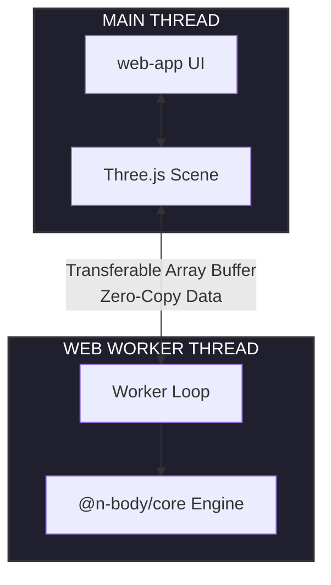

# High-Performance N-Body Simulator (Barnes-Hut Algorithm)

**[English](#english)** · **[Español](#español)**

---

<a id="english"></a>

**English Version**

3D interactive $N$-body web simulator optimized, designed as a fun computational astrophysics project, which implements advance concepts and browser performance improvements.

### 🌌 The Problem It Solves
Simulating gravitational interactions for $N$ particles using traditional brute-force physics requires an $O(N^2)$ computational complexity. As $N$ grows into tens of thousands of stars, the system introduces a massive computational bottleneck that freezes any modern browser. 

This project solves the performance ceiling by implementing the **Barnes-Hut Algorithm**. By partitioning 3D space into an **Octree**, distant clusters of particles are mathematically treated as a single body using their aggregate Center of Mass. This reduces the computational complexity to $O(N \log N)$, enabling fluid, real-time galactic simulations in JavaScript/TypeScript.

### 🏗️ Architecture & Data Flow (C4 Context)

The system leverages a decoupled, multi-threaded frontend architecture tailored for high-frequency numerical calculations without dropping frames.



The project is structured as a monorepo to keep track of the responsabilities clearly. 

1. **`packages/core`**: The pure physics engine. It contains the implementation of the `OctreeNode`, space partitioning bounds, and orbital integrators. It is 100% environment-agnostic.
2. **`packages/worker`**: The execution environment in backstage. It processes the heavy computational load (building the tree and calculating spatial forces) on a separate CPU thread via the Web Workers API.
3. **`packages/web-app`**: The presentation layer. Renders the computed vector fields at 60 FPS using WebGL shaders.

### 🛠️ Tech Stack
* **Language:** TypeScript (Strict Mode)
* **Graphics Rendering:** Three.js / WebGL
* **Parallelization:** Web Workers API (Transferable Objects / Shared Arrays)
* **Project Management:** NPM Workspaces

### ⚙️ Technical Decisions
* **Immutable 3D Vectors:** Vectors used for mathematical transformations are built using immutable patterns to prevent accidental side effects and state mutations inside concurrent environments.
* **Inline Center of Mass Evaluation:** Rather than traversing the entire Octree to re-evaluate structural weight distribution, the aggregate Center of Mass is evaluated dynamically in $O(1)$ time using localized linear momentum tracking during particle insertion.

### 🚀 How to Run It
1. Clone the repository.
2. Install dependencies from the root directory:
    ```bash
    npm install
3. Build the core physics module:
    ```bash
    npm run build --workspace=@n-body/core

🖼️ Screenshots & Diagrams
(Screenshots will be added as UI components are developed)

---

<a id="español"></a>

**Versión en español**

Simular interacciones gravitatorias para $N$ partículas utilizando la física tradicional de fuerza bruta requiere una complejidad computacional de $O(N^2)$. A medida que $N$ crece a decenas de miles de estrellas, el sistema introduce un cuello de botella masivo que congela cualquier navegador moderno.Este proyecto resuelve este límite de rendimiento implementando el Algoritmo Barnes-Hut. Al particionar el espacio 3D en un Octree, los cúmulos lejanos de partículas se tratan matemáticamente como un solo cuerpo a través de su Centro de Masa agregado. Esto reduce la complejidad computacional a $O(N \log N)$, permitiendo simulaciones galácticas fluidas en tiempo real dentro del navegador.

### 🏗️ Architecture & Data Flow (C4 Context)

El sistema aprovecha una arquitectura frontend desacoplada y multi-hilo, diseñada para cálculos numéricos de alta frecuencia sin pérdida de fotogramas.

El proyecto está estructurado como un monorepo para mantener una separación clara de responsabilidades:

* **`packages/core`**: El motor de física puro. Contiene la implementación desde cero de la estructura de datos **Octree**, el algoritmo de aproximación de **Barnes-Hut** y los integradores numéricos orbitales. Es 100% agnóstico del entorno (matemáticas puras).
* **`packages/worker`**: El entorno de ejecución en segundo plano. Procesa la carga pesada (construcción del árbol y cálculo de fuerzas espaciales) en un hilo de CPU separado a través de la API de **Web Workers**.
* **`packages/web-app`**: La capa visual y de interacción. Renderiza los campos vectoriales calculados a 60 FPS utilizando sombreadores (shaders) **WebGL** a través de **Three.js**.

## 🛠️ Stack Tecnológico

* **Lenguaje:** TypeScript (Strict Mode)
* **Renderizado Gráfico:** Three.js / WebGL
* **Paralelismo:** Web Workers API (Transferable Objects)
* **Gestión de Proyecto:** NPM Workspaces

### ⚙️ Technical Decisions
* **Vectores 3D Inmutables:** Los vectores utilizados para las transformaciones matemáticas se construyen bajo patrones inmutables para prevenir efectos secundarios accidentales y mutaciones de estado dentro de entornos concurrentes.
* **Evaluación de Centro de Masa en Línea:** En lugar de recorrer todo el Octree para reevaluar la distribución de peso estructural, el Centro de Masa agregado se evalúa dinámicamente en tiempo $O(1)$ utilizando el seguimiento del momento lineal localizado durante la inserción de partículas.

### 🚀 Cómo ejecutarlo
1. Clona el repositorio.
2. Instala las dependencias desde el directorio raíz:
    ```bash
    npm install
3. Compila el motor físico:
    ```bash
    npm run build --workspace=@n-body/core

🖼️ Screenshots y Diagramas
(Se añadirán capturas de pantalla conforme se desarrollen los componentes visuales)